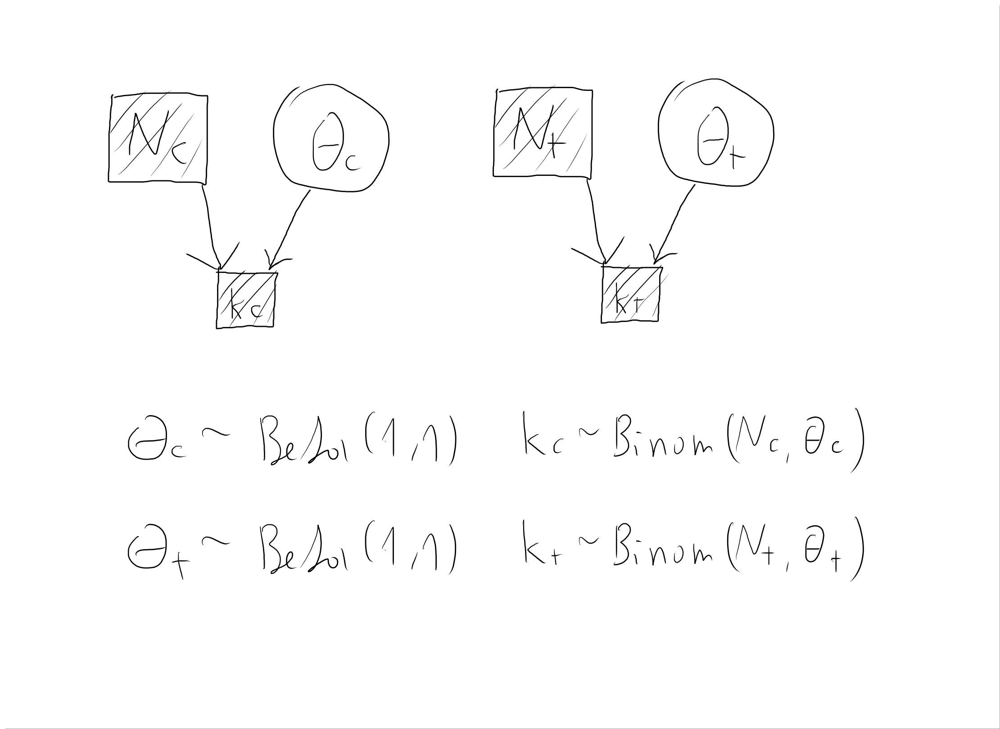

```{r setup, include=FALSE}

knitr::opts_chunk$set(echo = TRUE, error = F, message = F, warning = F)

```

```{r libraries, include=FALSE, message=FALSE, warning=FALSE}

# package for convenience functions (e.g. ggplot2, dplyr, etc.)
library(tidyverse)

# package for this course
library(aida)

# use the aida-theme for plotting
theme_set(theme_aida())

# global color scheme / non-optimized 
project_colors = c("#E69F00", "#56B4E9", "#009E73", "#F0E442", "#0072B2", "#D55E00", "#CC79A7", "#000000")

# setting theme colors globally
scale_colour_discrete <- function(...) {
  scale_colour_manual(..., values = project_colors)
}
scale_fill_discrete <- function(...) {
   scale_fill_manual(..., values = project_colors)
} 

# nicer global knitr options
knitr::opts_chunk$set(warning = FALSE, message = FALSE, 
                      cache = TRUE, fig.align = 'center')


```

# Instructions

* Create an Rmd-file with your group number (equivalent to StudIP group) in the 'author' heading and answer the following questions.
* When all answers are ready, 'Knit' the document to produce a HTML file.
* Create a ZIP archive called "IDA_HW03-Group-XYZ.zip" (where 'XYZ' is *your* group number) containing:
   * an R Markdown file "IDA_HW03-Group-XYZ.Rmd"
   * a knitted HTML document "IDA_HW03-Group-XYZ.html"
   * any other files necessary to compile your Rmarkdown to HTML (pictures etc.)
* Upload the ZIP archive on Stud.IP in your group folder before the deadline (see above). You may upload as many times as you like before the deadline, only your final submission will count.


# <span style = "color:firebrick">Exercise 1:</span> Sampling from and plotting composite random variables [10 points]

To increase our understanding of how random variables can be thought of as samples, and how composite random variables can easily be constructed by simple operations of samples, we are going to plot a few composite variables. We start with an example.

Let $X$, $Y$ and $Z$ be random variables such that $Z$ is defined in terms of $X$ and $Y$ as follows:

$$
\begin{align*}
  X & \sim \text{Normal}(0,1) \\
  Y & \sim \text{Normal}(5,0.001) \\
  Z & \sim X + Y
\end{align*}
$$

The goal of this exercise is to build intuitions about the shape of the distribution of $Z$. We do this by imagining sampling. We first sample from $X$ and $Y$, then compute samples of $Z$ in terms of the samples of $X$ and $Y$.

## Ex 1.a Complete the example [3 points]

Complete the code below to obtain a density plot of samples from composite random variable $Z$ as defined in the example above.

```{r , eval = F}
n_samples <- 1e6
tibble(
  x = rnorm(n_samples, 0, 1),
  y = rnorm(n_samples, 5 , 0.001),
  z = x+y
  ) %>% 
  ggplot(aes(x = z)) +
  geom_density()
```

## Ex 1.b Increasing standard deviation of $Y$ in previous example [1 point]

Describe in your own words how the shape of $Z$'s distribution will change if we increase the standard deviation of $Y$ to 1. You do not need to plot this, but you may.
## Answer:

Z will become wider, that is, its standard deviation will be 2, instead of 1,001. The mean stays the same as before (i.e. 5).

## Ex 1.c Irvin-Hall distribution [4 points]

The Irvin-Hall distribution is defined as the sum of $n$ independent draws from a uniform random variable. Formally, if $U_i \sim \text{Uniform}(0,1)$ with $1 \le i \le n$, then 
 $Z \sim \sum_{i=1}^n U_i$ is Irvin-Hall distributed with degree $n$. Use samples to plot the Irvine-Hall distribution for $n=2$, $n=3$ and $n=20$.
 
```{r}
irvin_hall <- function(degree) {
  
  n_samples <- 1e6
  
  cumul <- seq(0, 0, length.out=n_samples)
  
  for (i in 1:degree) {
    cumul <- cumul + runif(n_samples, 0, 1)
  }  
  
  
   tibble(x = cumul) %>% 
     ggplot(aes(x = x)) +
     geom_density()      
   }


irvin_hall(2)
irvin_hall(3)
irvin_hall(20)

```

 
## Ex 1.d Composite continuous and discrete random variables [2 points]

Give a density plot of composite random variable $Z$ which is built from a continuous and a discrete component. (**Suggestion:** To really build intuitions, try to intuit how the shape of $Z$'s distribution will likely look _before_ drawing samples and plotting.)


$$
\begin{align*}
  X & \sim \text{Beta}(1,1) \\
  Y & \sim \text{Binomial}(24,0.5) \\
  Z & \sim (X-0.5) + Y
\end{align*}
$$
```{r}
n_samples <- 1e6
tibble(
  x = rbeta(n_samples, 1, 1),
  y = rbinom(n_samples, 24 , 0.5),
  z = (x-0.5) + y
  ) %>% 
  ggplot(aes(x = z)) +
  geom_density()
```

# <span style = "color:firebrick">Exercise 2:</span> Estimating efficiency of the BioNTec/Pfizer vaccine [20 points]

We are going to use Bayesian inference to estimate how efficient the new BioNTec/Pfizer vaccine is.

According to [this article in the New York Times](https://www.nytimes.com/2020/11/18/health/pfizer-covid-vaccine.html), the study had roughly $N = 44,000$ participants. We here assume that it was precisely that number. Half of these participants were in the treatment group, so that $N_t = 22,000$, and half was in the control group, $N_{c} = 22,000$. The number of confirmed cases of Covid-19 in the control group was $k_c = 162$, and in the treatment group it was $k_t = 8$. 

```{r }
N_c <- 22000  # number of participants in control group
k_c <- 162    # number of Covid-19 cases in control group
N_t <- 22000  # number of participants in treatment group
k_t <- 8      # number of Covid-19 cases in treatment group
```

We are going to assume the following extension of the Binomial Model:

$$
\begin{align*}
  \theta_c & \sim \text{Beta}(1,1) & 
  k_c & \sim \text{Binom}(N_c, \theta_c) \\
  \theta_t & \sim \text{Beta}(1,1) & 
  k_t & \sim \text{Binom}(N_t, \theta_t)
\end{align*}
$$

## Ex 2.a Draw the model [3 points]

Based on the conventions used in the webbook, draw a graphical representation of this model and include it in using Rmarkdown into the HTML output of your submission. You can use a photo of a hand-drawn model, or use any kind of software. Just don't waste too much time on the aesthetics! Make sure to include the picture in your ZIP-submission and integrate.

## Answer



## Ex 2.b Specify the posterior distribution [2 points]

Use conjugacy of the Binomial Model to compute a concise mathematical form of the posterior distribution of $P(\theta_c \mid N_c, k_c)$ and $P(\theta_t \mid N_t, k_t)$ each.

## Answer:

Control: $\theta_c \mid N_c, k_c$   ~ Beta(1+162, 1+22000-162) = Beta(163, 21839)
Test: $\theta_t \mid N_t, k_t$ ~ Beta(1+8, 1+22000-8) = Beta(9, 21993)

## Ex 2.c Collect samples from these posterior distributions [1 point]

Collect 1,000,000 samples from the posterior distributions specified in the previous exercise and store each in a variable called `samples_c` and `samples_t`.
```{r}
samples_c <- rbeta(1000000, 163, 21839)
samples_t <- rbeta(1000000, 9, 21993)
```


## Ex 2.d Get Bayesian point and interval estimates [1 point]

Use the function `aida::summarize_sample_vector` to obtain Bayesian point-estimates (mean of posterior) and interval-ranged estimates (95% credible interval) of the posteriors for $\theta_c$ and $\theta_t$. 
```{r}
aida::summarize_sample_vector(samples_c, name = "control")
aida::summarize_sample_vector(samples_t, name = "test")
```


## Ex 2.e Interpret this result [4 points]

Based on your intuitive understanding of 95% Bayesian credible intervals and the results from the previous exercise, what would you conclude about the relevant research question of whether the vaccine is effective.

## Answer:

Given this model and the provided data, we can assume with an estimated certainty of 95% that the probability of infection by Covid19 without the vaccine should be between 0,0063% and 0,0086% with an expected value of 0,0074% (control group). With vaccine, the probability of infection should be between 0,0002% and 0,0007% with an expected value of 0,0004% (test group). 
If there are no differences between vaccinated and unvaccinated individuals with respect to confounding variables, we can calculate vaccine efficacy(VE) by this equation below.

VE = 100(I_c - I_t)/I_t

I_c = disease incidence in the controll group(unvaccinated group)
I_t = disease incidence in the treatment group(vaccinated group)

VE = 100(0,0074-0,0004)/0,0074 = 94.5

According to the calculation, the vaccine has 94.5% vaccine efficacy. Therefore, we can conclude that the vaccine is effective.

## Ex 2.e Efficiency of the treatment [3 points]

The efficiency of the treatment is operationalized as the factor by which the risk of attracting covid in the control group is reduced in the treatment group. We can deal with this derived notion in terms of a composed random variable. Let $X_t$ be the random variable that captures the posterior $P(\theta_t \mid N_t, k_t)$, and likewise for $X_c$. We are then interested in the derived random variable:

$$
  X_{\text{eff}} = \frac{X_t}{X_c}
$$

Explain in your own words what this random variable represents.

## Answer: 

This random variable represents by what factor the probability of getting an infection gets reduced when one is vaccinated vs. when not, given our estimated parameter values by our data. E.g. $X_{\text{eff}} = 0.5$ would mean that a vaccinated person is estimated to be twice as unlikely to get COVID, while $X_{\text{eff}} = 2$ would mean that a vaccinated person is estimated to be twice as LIKELY to get COVID (god forbid that happens!). The range of $X_{\text{eff}} =$ is in the range $(0, \infty)$

## Ex 2.f Plot samples of $X_{\text{eff}}$ [2 points]

Collect 1,000,000 samples of $X_{\text{eff}}$ and make a density plot.
```{r}
tibble(
  x = samples_t,
  y = samples_c,
  x_eff = x/y 
  ) %>% 
  ggplot(aes(x = x_eff)) +
  geom_density()
```


## Ex 2.f Interpret summary statistics of $X_{\text{eff}}$ [4 points]

Use the function `aida::summarize_sample_vector` to obtain Bayesian estimates of $X_{\text{eff}}$ (mean posterior and 95% credible interval). Use these numbers to fill in the blanks in the sentence below. (**Caveat:** You might have to transpose the numbers in a way that fits what's expressed in this sentence.) Notice that you have now calculated a nicely interpretable estimate of uncertainty concerning the efficiency of the new BiNTec/Pfizer drug.

> Given our model and the collected data, out best informed guess is that the vaccine reduces the risk of attracting Covid-19 by roughly 0,056 percent. Our margin of reasonable uncertainty is that the drug's efficiency lies roughly between a 0,022 percent risk reduction and a 0,093 percent risk reduction. 

```{r}
vaccine_eff <- tibble(
  x = samples_t,
  y = samples_c,
  x_eff = x/y 
  ) 

aida::summarize_sample_vector(vaccine_eff$x_eff, name = "efficiency factor Covid19 vaccine")
```


